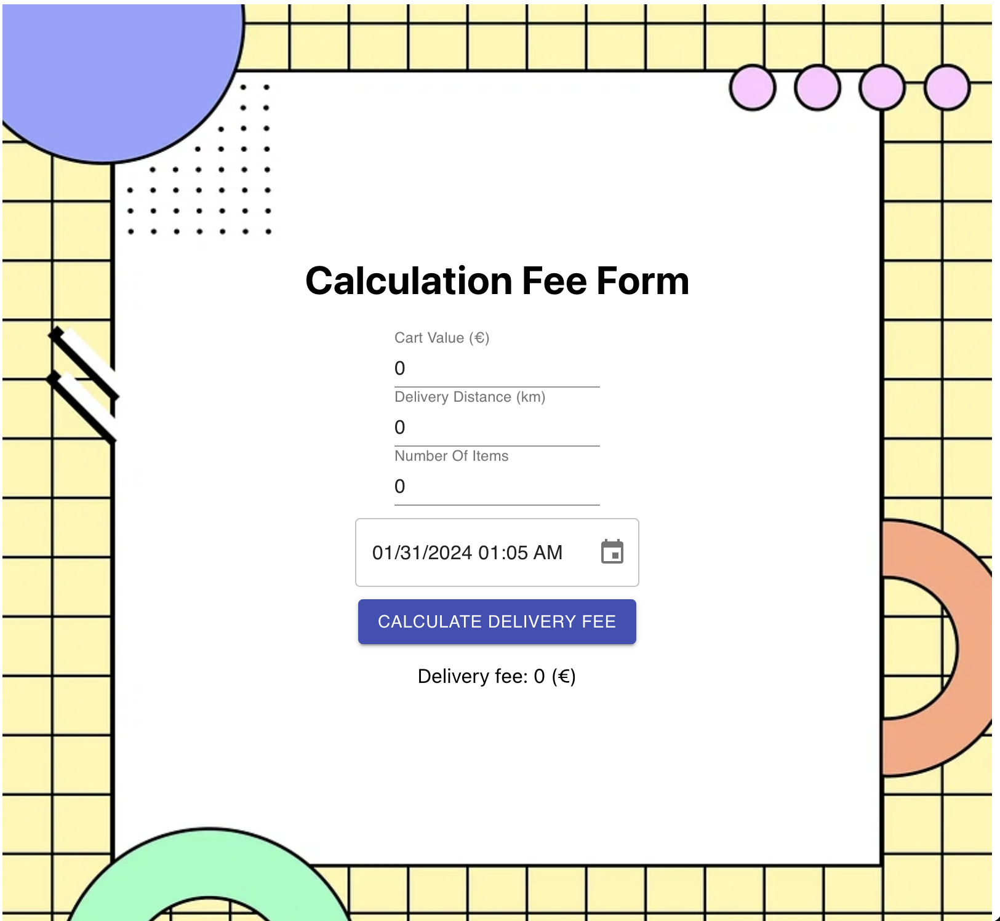

# Delivery Fee Calculator

The assignment is for Frontend internship in Finland.
The application is a calculation form where the user can enter information of the order and get the delivery fee.

[Deploy link](https://delivery-fee-calculation.vercel.app/)

## Run project and testing

- Install dependencies: `yarn` or `npm install`
- Start projects: `yarn start` or `npm run start`
- Run test: `yarn test` or `npm run test`
